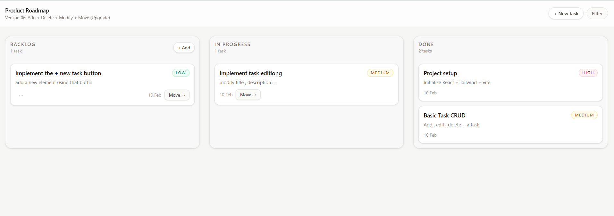

# 🧩 Kanban Board — Learning Project (React)

## 🚀 Want to Master React Fundamentals the Right Way?

This project is **part of a structured, paid Notion course** that teaches **React fundamentals for absolute beginners** — not by dumping theory, but by **guiding you step by step through real thinking, real mistakes, and real solutions**.

The course shows **exactly how this Kanban project is built**, using:
- exercises before code
- guiding questions
- detailed explanations
- clean, incremental solutions
- professional structure and mindset

👉 **If you want the full learning experience (not just the final code):**  
**Get the complete Notion course on Gumroad:**  


🔗 **[BUY THE REACT FUNDAMENTALS COURSE →](GUMROAD_LINK)**

> This repository shows *what* the solution looks like.  
> The course teaches you *how to think* to build it yourself — confidently and independently.

---


## 📸 Project Preview




---

## 🎯 Purpose of This Project

Many beginners struggle with React because they are shown **complete codebases without understanding the reasoning behind them**.

This project takes a different approach.

It is designed to help learners:

- Break a large problem into smaller, manageable tasks  
- Understand how React applications evolve incrementally  
- Learn how state, events, and data flow work together  
- Build a strong mental model instead of copying code  
- Think like a React developer, not just write React syntax  

Each version introduces **one new responsibility**, following real-world development practices.

---

## 👤 Who This Project Is For

This project is ideal for:

- Absolute beginners learning React  
- Developers who know React basics but feel lost structuring applications  
- Students preparing for real-world React projects  
- Self-learners who want to understand *why* code is written, not just *what* to write  

It is **not** designed to showcase advanced libraries or frameworks.  
The focus is on **fundamentals, structure, and developer mindset**.

---

## 🧠 How to Use This Repository

This repository is meant to be explored **commit by commit**.

Each commit represents:

- one version of the application  
- one clearly defined problem  
- one complete, working solution  

### Recommended workflow

1. Start from **Version 01**
2. Check out the corresponding commit
3. Read the exercise provided in the course material
4. Try to solve the problem on your own
5. Review the explanation
6. Compare your solution with the code in the commit
7. Move on to the next version

⚠️ Avoid jumping directly to the final commit — **the learning happens in the progression**.

---

## 🏗 How This Mirrors Real-World Development

In professional environments, applications are **not built in one step**.  
They evolve through:

- small, focused changes  
- stable intermediate versions  
- clear responsibilities per change  

This project follows the same approach:

- each commit represents a meaningful milestone  
- every version is usable and stable  
- complexity grows gradually, not all at once  

This teaches learners not only React, but also **how real software is built and maintained**.

---

## 📌 Project Versions (Commits)

| Version | Focus |
|--------|------|
| Version 01 | Layout creation (static UI, no logic) |
| Version 02 | Displaying tasks dynamically |
| Version 03 | Real data structure + adding tasks |
| Version 04 | Deleting a task safely |
| Version 05 | Modifying an existing task |
| Version 06 | Moving tasks across columns (workflow upgrade) |

Each commit represents a **stable and complete version** of the application at that stage.

---

## 🧩 What You’ll Learn

By working through this project step by step, you will learn:

- How to structure a React application  
- How to decide where state should live  
- How events flow from UI components to state updates  
- How to update data immutably  
- How to coordinate multiple components safely  
- How to apply business rules inside React applications  
- How real-world React projects are built incrementally  

---

## 🎓 Skills Developed

This project helps build practical, job-relevant skills:

- Component-based UI design  
- State ownership and lifting decisions  
- Immutable data handling  
- Event-driven logic  
- Incremental feature development  
- Debugging through isolated changes  
- Git commit discipline and versioning  

---

## ⚙️ Quick Start

```bash
git clone <repository-url>
cd kanban-board
npm install
npm run dev
```